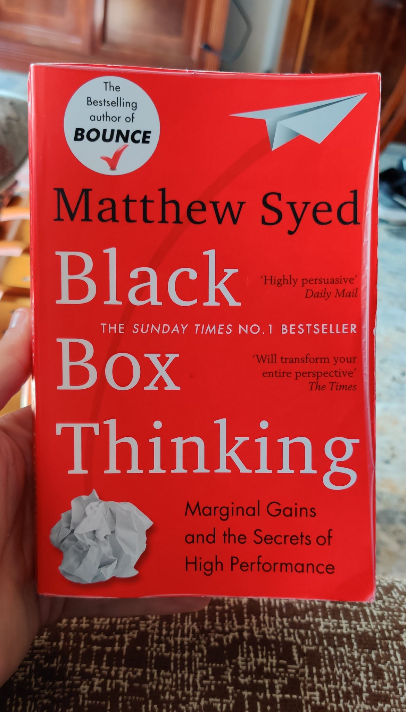

### Introducción
Una de las primeras cosas que hice al entrar en Amazon es pedir recomendaciones de libros a mis nuevos compañeros de equipo. Por un lado, porque cualquier ocasión es buena para descubrir nuevos libros; por otro, porque creo que una muy buena forma de conocer mejor a la gente es saber cuáles son sus libros favoritos, o más recomendados.

La mayor parte de recomendaciones fueron las clásicas para un developer: Clean Code, Effective Java, TDD by Example... No obstante, hubo un compañero que me recomendó cuatro libros que me sorprendieron por dos motivos: por un lado, porque no eran libros técnicos, sino sobre desarrollo personal o empresarial; por otro, porque nunca había oído hablar siquiera de ninguno de ellos. 

Normalmente, los libros que la gente recomienda suelen ser más o menos los mismos, clásicos como los que mencionaba antes (y en realidad tiene sentido: son libros muy buenos). El hecho de que me recomendasen algo fuera de lo habitual despertó totalmente mi curiosidad, por lo que decidí lanzarme a la piscina y ese mismo día compré uno de ellos: Black Box Thinking.

### Review
A grandes rasgos, *Black Box Thinking* va sobre la importancia de una cultura empresarial en la que se valore y potencie el analizar las cosas que han salido mal y se ponga mucho énfasis en aprender de los errores. El "Black Box" del título hace referencia a las cajas negras de los aviones, cuya finalidad es precisamente el permitirnos saber qué cosas fallaron en un accidente para así poder prevenirlas en el futuro.

A lo largo de libro, analiza los distintos obstáculos que nos podemos encontrar para crear una cultura de este tipo y cómo superarlos

Y lo mejor de todo es que pone el foco tanto en los obstáculos de metodología (no hay datos suficientes, las técnicas de producción de la empresa no son las óptimas) como en los psicológicos (sesgos cognitivos, cultura del "blaming", miedo al fracaso)

Para mí, la parte psicológica es la que lo hace más interesante: tenemos muchísimos sesgos y prejuicios que nos impiden juzgar las cosas de forma objetiva, y el libro es un genial recurso para empezar a ser conscientes de ello.

Además, la estructura es bastante interesante: todos los puntos que presenta los explica con ejemplos reales de empresas (Dyson, Unilever), industrias (aviación, medicina) e incluso personas (Beckham), lo que lo hace más ameno y llevadero

Como única parte negativa, diría que hacia el final se va volviendo un poco repetitivo: sigue reforzando mucho los mensajes que ya ha dado y presenta ideas muy similares a las ya vistas, así que no os sintáis culpables por saltaros alguna sección.

### Conclusión
*Black Box Thinking* es sin duda uno de esos libros que te abre los ojos. Aprender de nuestros errores es muy difícil, porque en muchos casos ni siquiera nos damos cuenta de que los hemos cometido: no tenemos datos, no asumimos el error, decimos que "son cosas que pasan"...

Conocer el problema es el primer paso para solucionarlo, y el libro hace un maravilloso trabajo en ese aspecto. Definitivamente, tras leerlo empiezas a ser más consciente de muchos de los errores que cometes en tu día a día

En resumen: una grata sorpresa, porque hasta que me lo recomendaron no había oído hablar nunca de él, y a pesar de ello me llevo muchos aprendizajes y muy buenos.

[Black Box Thinking en Amazon](https://amzn.to/2N3vZPA)